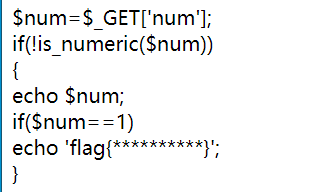
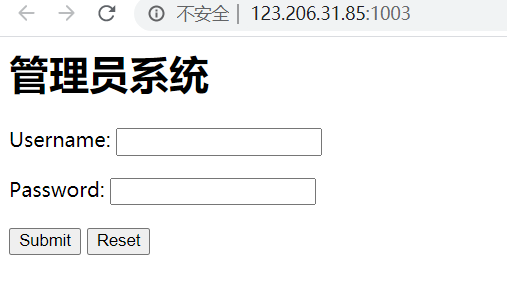
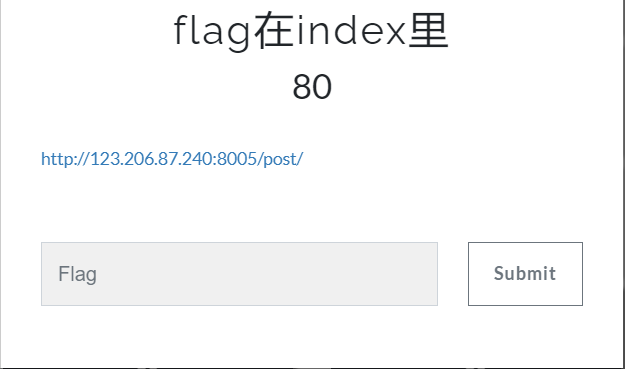
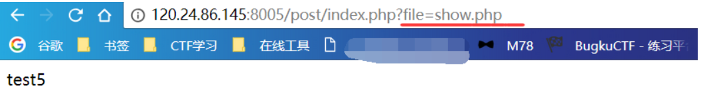

####今日所做题目：
几个影响深刻的题目总结如下:

这道题主要是涉及到PHP这种弱类型语言的隐含的类型转换的问题，1x转换为整形就是1，类似于这种，在各种安全保护措施中，也经常会用到。需要加强记忆

这道题则是对代码的阅读问题，通过阅读代码，不难看出是一个加查询参数的问题，他导入了一个文件，这个文件是我们看不到的，但是这个文件类有我们要的flag，而且看最后一句，我们查询给的参数就是变量的名字，无从下手，只有全局变量

这里表面上是一个穷举问题，但实际上他是一个查找问题，在源代码中有一段加密数据就是其密码，他的账号就是admin，管理员登陆系统密码不是admin就奇了怪了。

这道题其实是一个PHP://协议内的问题，他的具体参考，我直接放链接：
[PHP封装协议](http://php.net/manual/zh/wrappers.php.php)

注意查看其中的url部分，这是一个典型的文件包含漏洞（刚拿到这道题的时候，并没有对这个有多少了解），然后，我参考上面的文档，将查询参数进行以下的调整，就可以做出下面的代码查询：http://120.24.86.145:8005/post/index.php?file=php://filter/read=convert.base64-encode/resource=index.php
下面来解释一下这个链接的含义：
现在具体说说file=php://filter/read=convert.base64-encode/resource=index.php的含义：
```
    首先这是一个file关键字的get参数传递，php://是一种协议名称，php://filter/是一种访问本地文件的协议，/read=convert.base64-encode/表示读取的方式是base64编码后，resource=index.php表示目标文件为index.php。
    通过传递这个参数可以得到index.php的源码，下面说说为什么，看到源码中的include函数，这个表示从外部引入php文件并执行，如果执行不成功，就返回文件的源码。
    而include的内容是由用户控制的，所以通过我们传递的file参数，是include（）函数引入了index.php的base64编码格式，因为是base64编码格式，所以执行不成功，返回源码，所以我们得到了源码的base64格式，解码即可。
    如果不进行base64编码传入，就会直接执行，而flag的信息在注释中，是得不到的。
    我们再看一下源码中 存在对 ../ tp data input 的过滤，其实这都是php://协议中的其他方法，都可以结合文件包含漏洞执行，具体可以百度一下
```
